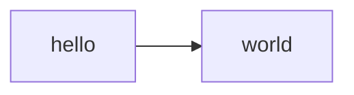
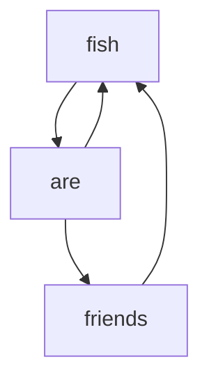
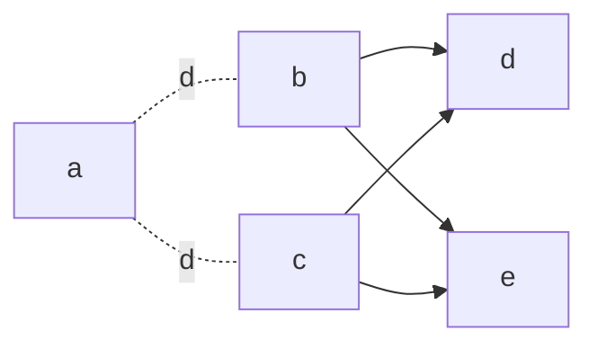

# Mermaid TS

## Examples

Minimal

```typescript
flowchart()
  .link("hello", "world")
  .render()
```



Complex links

```typescript
const a = node("fish")
const b = node("are")
const c = node("friends")

flowchart({ direction: 'TD' })
  .link(a, b, [a, c])
  .link(c, a)
  .render()
```



More options

```typescript
flowchart({ direction: 'LR' })
  .link(
    "a",
    { kind:'-.-', text: 'd' },
    ["b", "c"],
    {},
    ["d", "e"],
  )
  .render()
```



Flowchart TODO
- Shapes
- Node text (not id) & escaping
- The rest of the link syntax options
- Link lengths
- Subgraphs
- Styling

Other TODO
- sequence diagrams
- others
